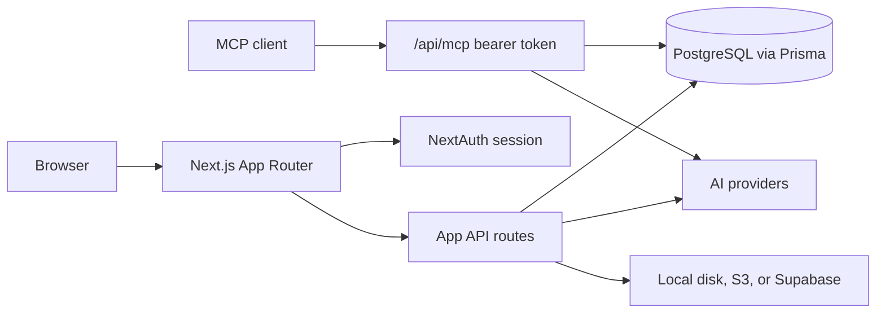

# Job Search Assistant

A Next.js app that writes a resume and cover letter for one job posting, scores how well they match, and tracks the application. The same actions are available to an AI agent over a remote MCP server.

You keep a single profile: experience, education, projects, links, and skills. For each role you paste the description. The app drafts the resume and cover letter from that profile, scores the resume against the posting, and files the result on the application. You can do this in the browser, or hand the same steps to an agent.

Live app: [https://job-search-assistant-lake.vercel.app](https://job-search-assistant-lake.vercel.app)

## Features

- Sign in with email and password, or with Google (NextAuth).
- A structured profile you can edit after signup.
- Job applications with a status: `pending`, `draft`, `submitted`, `interviewing`, `accepted`, or `rejected`.
- A generated resume (text, JSON, and PDF), a cover letter, and a strength score from 0 to 100 with written gaps (missing keywords, skill gaps, section notes).
- An ATS optimization toggle in Settings. It changes the generation prompt. See limitations.
- Your own OpenAI, Google, Anthropic, or DeepSeek key, stored encrypted. Server env keys are the fallback when you have not saved one.
- Files on local disk, Amazon S3, or Supabase, chosen with `STORAGE_PROVIDER`.
- An admin metrics area for users whose role is `ADMIN`.
- A remote MCP server with six tools, authenticated by a per-user bearer token.

## Use it from an AI agent (MCP)

The server is the Next.js route `src/app/api/mcp/route.ts`. Tools are registered in `src/lib/mcp/tools.ts`.

The route calls `createMcpHandler` from `mcp-handler` 2.2.0. That package serves the current MCP HTTP protocol and answers older clients with stateless Streamable HTTP. Its peer dependency is `@modelcontextprotocol/server` (2.0.0 in the lockfile). `package.json` also depends on `@modelcontextprotocol/sdk` 1.30.0. The route imports `mcp-handler`, not the SDK package.

Production: `https://job-search-assistant-lake.vercel.app/api/mcp`

Local: `http://localhost:3000/api/mcp`

GET and POST both require this header:

```http
Authorization: Bearer mcp_<userId>_<secret>
```

A request without a `Bearer mcp_` token gets `401` and `{"error":"Unauthorized"}`.

### Generate a token

1. Sign in.
2. Open **Settings**, then **API keys** (`/settings/api-keys`).
3. On the **MCP Access Token** card, click **Generate Key**.
4. Copy the token from the toast. The full value is shown once, for about 10 seconds. After that the page only shows a masked copy. **Revoke Key** deletes it.

The server builds `mcp_<userId>_<48 hex chars>`, encrypts it with AES-256-CBC (`ENCRYPTION_KEY`), and stores it on `UserApiKey` with provider `mcp`. Each request splits the user id out of the token and checks the full string against the decrypted row.

### Tools

| Tool | Purpose | Arguments |
| --- | --- | --- |
| `get_profile` | Read the token user's profile: name, bio, location, phone, links, skills, experience, education, projects. | none |
| `update_profile` | Update a few profile fields and return them. | `name?`, `bio?`, `skills?` (string array), `location?` |
| `create_job_application` | Create an application with status `pending` and empty documents. Returns the id. | `jobTitle`, `companyName`, `jobDescription` |
| `get_job_application` | Read one application, including documents and score. Refuses another user's row. | `jobId` (uuid) |
| `list_job_applications` | List up to 10 newest applications: id, title, company, status, score, `createdAt`. | none |
| `generate_documents` | Draft a resume and cover letter, score the resume, save them, and set status to `submitted`. | `jobId` (uuid) |

`generate_documents` returns the score and the first 200 characters of the cover letter. It writes plain text onto the application. The browser generate route also writes a PDF, a JSON file, and a `ResumeInsight` row. The MCP tool does not.

### Client config

Cursor (`~/.cursor/mcp.json` or the project `.cursor/mcp.json`) and Claude Desktop (`claude_desktop_config.json`) use the same remote-server shape:

```json
{
  "mcpServers": {
    "job-search-assistant": {
      "url": "https://job-search-assistant-lake.vercel.app/api/mcp",
      "headers": {
        "Authorization": "Bearer mcp_<userId>_<secret>"
      }
    }
  }
}
```

Paste the token from Settings in place of the bearer value. For a local server, set `url` to `http://localhost:3000/api/mcp`.

## Tech stack

- Next.js 15.3 (App Router). `npm run dev` uses Turbopack.
- React 19, TypeScript, Tailwind CSS 4, Radix UI.
- NextAuth 4 with the Prisma adapter. Credentials and Google.
- Prisma 5 and PostgreSQL.
- Zod on API bodies and on MCP tool inputs.
- OpenAI, Google Gemini, Anthropic, and DeepSeek. You pick the provider and model in Settings.
- `mcp-handler` 2.2 for `/api/mcp`.
- Storage: local filesystem, AWS S3, or Supabase (S3-compatible endpoint).
- PDFs with `@react-pdf/renderer` and `pdf-lib`.

## Architecture



The browser uses a NextAuth session. Routes under `src/app/api` (other than MCP) read that session. `/api/mcp` checks the bearer token, then the tools load the user from the `Authorization` header and call Prisma plus the same generation code as the web app (`src/lib/ai`). The web generate path also stores files. The MCP generate tool writes text columns only.

## Local setup

You need Node.js 20 or newer (`mcp-handler` requires it), a PostgreSQL database, and an OpenAI or Google AI key if you want generation to run.

```bash
git clone https://github.com/tundx0/job-search-assistant.git
cd job-search-assistant
npm install
cp .env.example .env
npx prisma generate
npx prisma migrate dev
npm run dev
```

Open [http://localhost:3000](http://localhost:3000).

`npm run db:seed` upserts an admin user. Set `ADMIN_PASSWORD` before seeding any shared database. If it is unset in local development, the seed script uses the password documented in `.env.example`.

### Environment variables

Copy `.env.example` to `.env` and fill these in. Names only.

App:

- `DATABASE_URL`
- `NEXTAUTH_URL`
- `NEXTAUTH_SECRET`
- `ENCRYPTION_KEY` (32 or more characters; encrypts saved API keys and the MCP token)
- `ADMIN_PASSWORD`
- `ALLOW_DEV_PASSWORD_RESET` (when `true` and `NODE_ENV` is not `production`, the forgot-password API returns the reset link in the response)

Google sign-in:

- `GOOGLE_CLIENT_ID`
- `GOOGLE_CLIENT_SECRET`

AI. A key saved in Settings is used before the matching env var. Generation needs at least one system key until the user saves their own.

- `OPENAI_API_KEY`
- `GOOGLE_AI_API_KEY`
- `GOOGLE_API_KEY`
- `USE_GOOGLE_AI`
- `ANTHROPIC_API_KEY`
- `DEEPSEEK_API_KEY`

Storage. `STORAGE_PROVIDER` is `local`, `aws`, or `supabase`. The example file sets `local`.

- `LOCAL_STORAGE_PATH`
- `AWS_REGION`, `AWS_ACCESS_KEY_ID`, `AWS_SECRET_ACCESS_KEY`, `AWS_S3_BUCKET`
- `SUPABASE_URL`, `SUPABASE_ANON_KEY`, `SUPABASE_SERVICE_KEY`
- `S3_ACCESS_KEY_ID`, `S3_SECRET_ACCESS_KEY`, `S3_BUCKET`, `S3_REGION` (read by the Supabase provider)

`.env.example` also lists `CLOUDINARY_CLOUD_NAME`, `CLOUDINARY_API_KEY`, `CLOUDINARY_API_SECRET`, and `SUPABASE_BUCKET`. Nothing in `src/` reads those four.

### Scripts

These are the scripts in `package.json`:

- `npm run dev` starts the dev server with Turbopack.
- `npm run build` runs `next build`.
- `npm run start` serves the production build.
- `npm run lint` runs `next lint`.
- `npm run db:seed` seeds the admin user.

There is no `test` script. Jest and Testing Library are installed, and `src/__tests__` has component, API, auth, PDF, and AI-provider tests, but the repo has no Jest config.

## Limitations

- Nothing tests or evaluates the MCP route or its tools.
- `list_job_applications` stops at 10 rows.
- `update_profile` writes `name`, `bio`, `skills`, and `location`. Experience, education, projects, and the other contact fields are editable on the profile page, not through this tool.
- `generate_documents` sets status to `submitted` and skips PDF storage and `ResumeInsight`.
- The base resume prompt asks for an ATS-compatible draft. With the ATS toggle on, the prompt also allows skills inferred from the profile and added metrics. That is a prompt change, not a check against an ATS product.
- The strength score is the model's read of the resume against the posting. It is not a vendor ATS score.
- Password reset does not send email. The dev flag above returns the link in the JSON response.
- `mcp-handler` requires the peer `@modelcontextprotocol/server`. The lockfile records that peer. The direct MCP dependency declared in `package.json` is `@modelcontextprotocol/sdk` 1.x.
